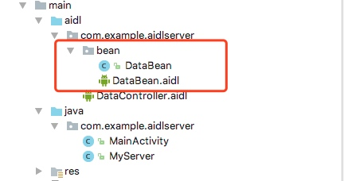

# AIDL

## 数据类型

1. 基本数据类型，byte，short，int，long，float，double，boolean，char。
2. String
3. CharSequence
4. 自定义的parcelable：其java文件必须实现Parcelable接口
5. List
6. Map

例如：自定义parcelable

**DataBean.aidl**

```java
// DataBean.aidl
//这个文件的作用是引入了一个序列化对象 DataBean 供其他的AIDL文件使用
//注意：这个DataBean.aidl包名必须和java文件夹下的DataBean.java包名一致
package com.example.aidlserver.bean;

// Declare any non-default types here with import statements
//parcelable 小写p
parcelable DataBean;
```
**DataController.aidl**

```java
// DataController.aidl
package com.example.aidlserver;

// Declare any non-default types here with import statements
//导入所需要的非默认支持数据类型包，即使在同一包下也必须指定
import com.example.aidlserver.bean.DataBean;

interface DataController {
    //传参数如果是非默认支持数据类型，前需要加tag（in，out，inout）
   void addDataInOut(inout DataBean data);
   //所有的返回值前都不需要家人和修饰符，无论任何数据类型
    List<DataBean> getData();
}
```
**DataBean.java**
### **注意：**
该类包名必须和相应的aidl包名一致，在AndroidStudio移植到客户端的时，客户端包名和服务端包名不一致会导致无法将.java移植到客户端java包下，解决办法就是吧该.java放在aidl目录下如：


这样就可以直接将aidl目录直接拷贝到客户端main目录下


如果出现找不到aidl包下的.java文件时需要在build.gradle文件：android{}中添加一下内容

```java
sourceSets {
    main {
        java.srcDirs = ['src/main/java', 'src/main/aidl']
    }
}
```
**DataBean.java示例代码：**

```java
package com.example.aidlserver.bean;

import android.os.Parcel;
import android.os.Parcelable;

/**
 * Created by JiaShuai on 2018/2/9.
 */

public class DataBean implements Parcelable {
    private String dataName;
    private int dataInt;
    public DataBean(){}

 ........略过Parcelable生成的方法........

    @Override
    public void writeToParcel(Parcel dest, int flags) {
        dest.writeString(dataName);
        dest.writeInt(dataInt);
    }
    /**
    *该方法需要手动添加
    *
    **/
    public void readFromParcel(Parcel dest) {
        //注意，此处的读值顺序应当是和writeToParcel()方法中一致的
        dataName = dest.readString();
        dataInt = dest.readInt();
    }
.........略过get，set方法.......
}
```

## AIDL tag

Java 中的基本类型和 String ，CharSequence 的定向 tag 默认且只能是 in 。还有，请注意，请不要滥用定向 tag

编写aidl文件传递非默认类型的参数时需要指定tag(in,out,inout)

**tag** AIDL中的定向tag表示了在跨进程通讯中数据流向，其中

1. in: 表示数据只能由客户端流向服务器端，
2. out：表示数据只能由服务端流向客户端，
3. inout：则表示数据可以在服务端和客户端之间双向流通。

数据流向是指对客户端中的那个传入方法的对象而言。

1. in：表现为服务端将会接收到这个对象的完整数据，当服务端接收该对象后直接修改该对象的值，客户端不会发生改变；
2. out：表现为服务端将会接收这个对象的一个空值（注意这里不是空而是对象值是空的），但是在服务端修改该对象的值后，客户端则会发生改变；
3. inout：表现为服务端接接收完整数据，修改参数后客户端会相应的发生改变；

**验证：** AidlDemo中查看log演示


## [原文链接](http://blog.csdn.net/luoyanglizi/article/details/51980630)

## [代码地址](https://github.com/jiashuaishuai/AidlDemo)


